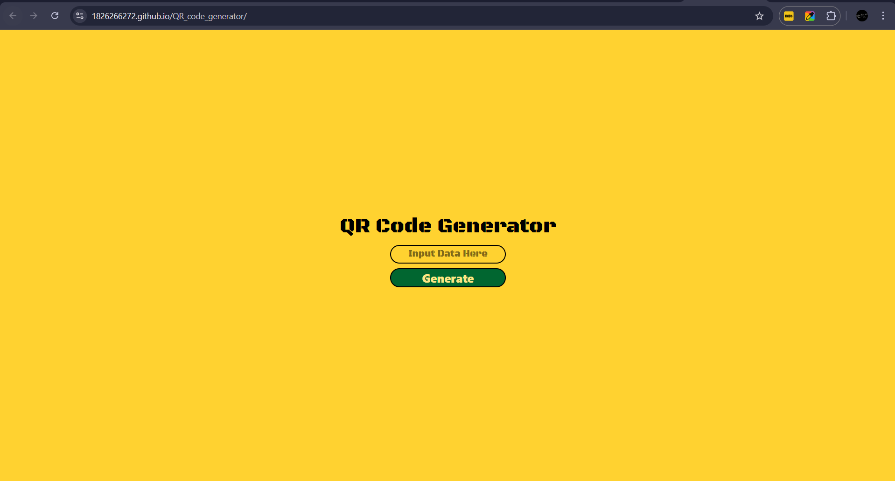
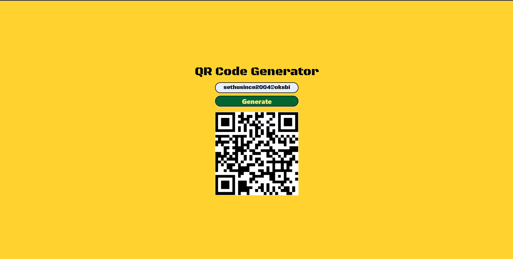

# 🔳 QR Code Generator



A simple and responsive web application that generates QR codes instantly from user input such as URLs or text.

This project demonstrates DOM manipulation, API integration, and frontend UI design using core web technologies.

---

## 🚀 Features

* Generate QR codes instantly
* Supports text and URL input
* Clean and minimal UI
* Responsive design
* Lightweight and fast

---

## 🧰 Tech Stack


---

## 📸 Preview



---

## ⚙️ How to Run Locally

Clone the repository:

```
git clone https://github.com/1826266272/QR_code_generator.git
```

Open the project folder and run:

* Open `index.html` in your browser
  or
* Use VS Code Live Server

---

## 📁 Project Structure

```
QR_code_generator
│
├── index.html
├── style.css
├── script.js
└── README.md
```

---

## 🧠 What I Learned

* Working with JavaScript events
* DOM manipulation
* Using QR code generation libraries/APIs
* UI styling with CSS
* Handling user input validation

---

## 👨‍💻 Author

**Sethu**
Frontend Developer in progress 🚀
